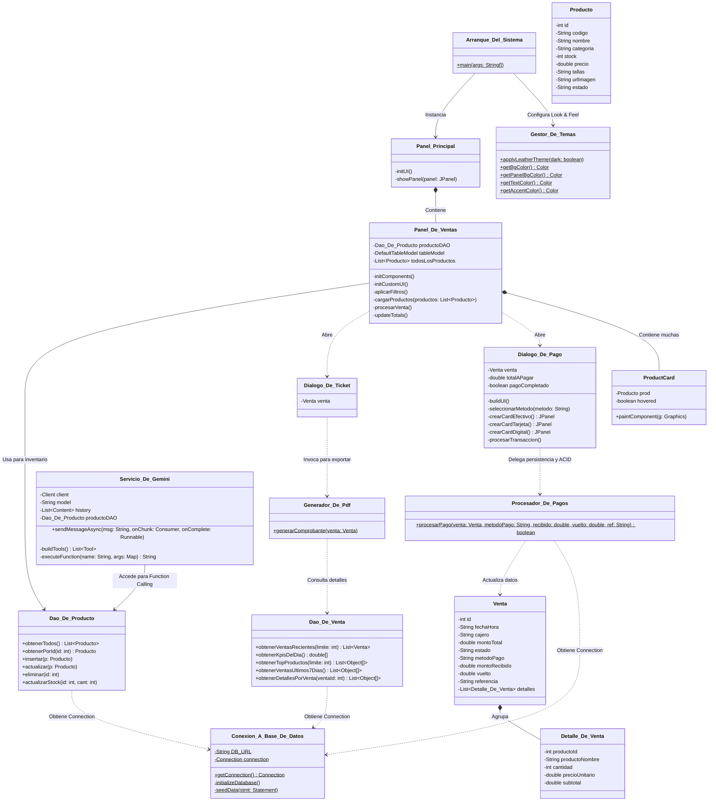
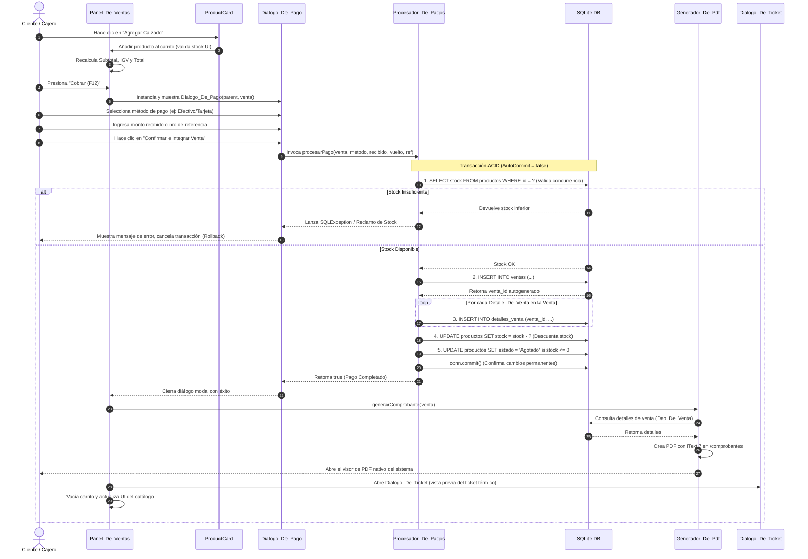

# INFORME DE AUDITORÍA TÉCNICA Y ARQUITECTURA
**Proyecto:** Sistema de Venta y Gestión de Calzado (SENATI ZAPATO)  
**Rol:** Arquitecto de Software Senior y Documentador Técnico  
**Fecha:** 29 de Mayo de 2026  

---

## 1. Resumen Ejecutivo
El **Sistema de Venta y Gestión de Calzado (SENATI ZAPATO)** es una aplicación empresarial de escritorio tipo **POS (Point of Sale)** construida en Java, diseñada para automatizar, controlar y optimizar el proceso de venta, control de inventarios, reportes de ingresos y soporte inteligente en zapaterías.

### Objetivo Principal
Brindar un entorno tecnológico unificado, robusto y de alto rendimiento que permita:
1. **Registrar y Cobrar Ventas:** Manejar un carrito de compras dinámico y procesar pagos a través de múltiples canales (efectivo, tarjetas, billeteras digitales Yape/Plin, y transferencias bancarias).
2. **Garantizar la Integridad del Inventario:** Descontar stock y actualizar estados en tiempo real bajo estrictas garantías transaccionales.
3. **Generar Comprobantes Legales:** Exportar automáticamente boletas de venta formateadas en PDF de alta calidad corporativa utilizando el motor iText 7.
4. **Asistente Inteligente con IA:** Integrar un chatbot interactivo conectado a la API de **Google Gemini** con capacidades de **Function Calling** para gestionar de forma conversacional el inventario y absolver consultas del personal en tiempo real.

---

## 2. Arquitectura y Estructura

### Organización del Proyecto (Paquetes y Responsabilidades)
El sistema adopta una arquitectura multicapa desacoplada y organizada de la siguiente manera dentro del paquete raíz `com.mycompany.senati_zapato`:

```
com.mycompany.senati_zapato
│
├── ui [Capa UI - Presentación]
│   ├── Panel_Principal.java       # Ventana contenedora y control de navegación principal
│   ├── Panel_De_Inicio.java           # Dashboard de bienvenida y KPIs analíticos rápidos
│   ├── Panel_De_Ventas.java           # Terminal Punto de Venta (POS) con catálogo y carrito
│   ├── Panel_De_Inventario.java           # Panel administrativo del catálogo de calzados
│   ├── Panel_De_Reportes.java         # Dashboard analítico de ventas semanales y KPIs diarios
│   ├── Panel_De_Chatbot.java          # Interfaz conversacional con el asistente de IA
│   ├── Dialogo_De_Pago.java            # Formulario modal de pagos multicanal
│   ├── Dialogo_De_Ticket.java          # Visor embebido de tickets de venta
│   ├── Gestor_De_Temas.java          # Gestor centralizado del Look & Feel (FlatLaf)
│   ├── Icono_Elegante.java           # Renderizador optimizado de iconos vectoriales
│   └── Boton_De_Pestana.java             # Componente de navegación personalizado
│
├── datos [Capa de Acceso a Datos]
│   ├── Conexion_A_Base_De_Datos.java
│   ├── Dao_De_Producto.java
│   └── Dao_De_Venta.java
│
├── servicios [Capa de Negocio y Servicios]
│   ├── Procesador_De_Pagos.java
│   ├── Servicio_De_Gemini.java
│   └── Servicio_De_Voz_En_Vivo.java
│   ├── Conexion_A_Base_De_Datos.java    # Gestor JDBC y control de migraciones SQLite
│   ├── Procesador_De_Pagos.java      # Motor transaccional ACID de cobro y validación de stock
│   ├── Dao_De_Producto.java           # Acceso a datos (CRUD) para la tabla 'productos'
│   ├── Dao_De_Venta.java              # Acceso a datos (Lecturas complejas y KPIs) de ventas
│   └── Servicio_De_Gemini.java         # Integración GenAI con Google SDK y Function Calling
│
├── models [Capa de Dominio]
│   ├── Producto.java              # POJO que mapea las propiedades de un calzado
│   ├── Venta.java                 # POJO que consolida los datos de cabecera de la transacción
│   └── Detalle_De_Venta.java          # POJO que representa el ítem individual en una boleta
│
└── utilidades [Capa Transversal/Utilidades]
    └── Generador_De_Pdf.java          # Engine iText 7 para generación de comprobantes PDF
```

---

### Flujo de Datos Principal
El procesamiento de un pedido de compra y despacho de calzado sigue el siguiente flujo de datos extremo a extremo:

1. **Catálogo y UI:** El cajero inicia la operación en `Panel_De_Ventas`. El sistema consulta los productos disponibles llamando a `Dao_De_Producto.obtenerTodos()`. La UI renderiza tarjetas (`ProductCard`) dinámicas y asíncronas para cada calzado.
2. **Preparación del Carrito:** El usuario agrega calzados al carrito. El sistema valida visualmente el stock remanente y actualiza en tiempo real el Subtotal, el IGV (18%) y el Total en la UI de forma reactiva.
3. **Iniciación de Pago:** Al presionar "Cobrar (F12)", se crea un objeto `Venta` con sus correspondientes objetos `Detalle_De_Venta` vinculados. Se abre el diálogo modal bloqueante `Dialogo_De_Pago` inyectando el objeto venta.
4. **Procesamiento de Pago Transaccional (ACID):** El cliente selecciona el método de pago e introduce los montos o la referencia del comprobante digital. Al hacer clic en "Confirmar e Integrar", se delega la persistencia a `Procesador_De_Pagos.procesarPago()`.
   - Se abre una transacción en SQLite (`conn.setAutoCommit(false)`).
   - Se valida el stock directamente en base de datos para evitar problemas de concurrencia.
   - Se inserta la cabecera en la tabla `ventas` y se captura el ID generado.
   - Se insertan los registros en `detalles_venta` con el ID correspondiente.
   - Se reduce el stock en la tabla `productos` y se marca automáticamente como `'Agotado'` si el stock llega a 0.
   - Si no hay excepciones, se ejecuta `conn.commit()`. En caso de cualquier error, se ejecuta `conn.rollback()` para revertir todo al estado original.
5. **Generación y Despacho:** Tras el éxito de la transacción, `Generador_De_Pdf.generarComprobante()` lee la información consolidada desde la BD usando `Dao_De_Venta.obtenerDetallesPorVenta()` y compila un documento PDF corporativo en la carpeta `/comprobantes`, abriéndolo automáticamente con el lector de PDF predeterminado del sistema operativo.
6. **Cierre de Ciclo:** Se vacía el carrito, se abre el diálogo de previsualización `Dialogo_De_Ticket`, y el catálogo se refresca trayendo los nuevos estados y stocks actualizados de la base de datos local.

---

## 3. Análisis Técnico

### Stack Tecnológico
*   **Lenguaje de Programación:** Java (JDK Release 20).
*   **Gestor de Dependencias:** Maven (POM.xml).
*   **Base de Datos:** SQLite con driver JDBC oficial (`sqlite-jdbc` v3.45.1.0).
*   **Capa de Diseño Visual (L&F):** FlatLaf v3.5.1 (Warm Leather Theme - Aspecto premium).
*   **Motor de Generación PDF:** iText 7 Core v7.2.5 (Gestión de layout de comprobantes).
*   **Motor de Inteligencia Artificial:** SDK oficial de Google GenAI v1.55.0 (`google-genai`), con el modelo LLM `gemma-4-26b-a4b-it`.

---

### Diagrama de Clases (Arquitectura del Sistema)
Este diagrama representa la estructura de clases del proyecto, detallando sus atributos principales, métodos y relaciones de dependencia.



---

### Diagrama de Secuencia (Flujo Crítico de Transacción de Venta)
Representa la secuencia interactiva de llamadas entre componentes en el momento clave de concretar un pedido.



---

### Detalle de Componentes Críticos

#### 1. `db.Conexion_A_Base_De_Datos.java`
*   **Responsabilidad:** Implementa el patrón Singleton para la conexión JDBC y controla el ciclo de vida de la base de datos local SQLite (`senati_zapato.db`).
*   **Métodos Críticos:**
    *   `getConnection()`: Retorna o inicializa la conexión persistente.
    *   `initializeDatabase()`: Ejecuta la creación del DDL (`productos`, `ventas`, `detalles_venta`) e implementa parches dinámicos (`ALTER TABLE`) para asegurar la compatibilidad con versiones previas del esquema de base de datos sin pérdida de datos.

#### 2. `db.Procesador_De_Pagos.java`
*   **Responsabilidad:** Motor de control de reglas de negocio financieras. Garantiza que no existan inconsistencias de inventario (venta sin stock) y orquesta transacciones robustas con semántica ACID estricta.
*   **Métodos Críticos:**
    *   `procesarPago(...)`: Deshabilita el auto-commit de la base de datos para iniciar la transacción. Ejecuta una validación secuencial del stock en la BD para evitar compras dobles simultáneas. Inserta la cabecera y el detalle en BD, descuenta el stock de manera física y maneja la transición de estado a `'Agotado'` si el inventario se vacía. En caso de fallas físicas, ejecuta un rollback instantáneo.

#### 3. `db.Servicio_De_Gemini.java`
*   **Responsabilidad:** Engine conversacional e integrador de inteligencia artificial con soporte de Function Calling.
*   **Métodos Críticos:**
    *   `buildTools()`: Define en formato JSON-Schema las firmas de las funciones nativas en Java expuestas al modelo de lenguaje LLM (`buscar_producto`, `verificar_stock`, `listar_productos`, `agregar_producto`).
    *   `executeFunction(...)`: Callback que traduce la decisión del modelo inteligente de invocar una función en llamadas dinámicas a los DAOs en Java, retornando el resultado en lenguaje natural estructurado al flujo conversacional del asistente.
    *   `sendMessageAsync(...)`: Procesa en un hilo asíncrono secundario la interacción conversacional de texto e imágenes (multimodalidad) con streaming de tokens.

#### 4. `utils.Generador_De_Pdf.java`
*   **Responsabilidad:** Motor de layouts de iText 7 para emitir comprobantes legales.
*   **Métodos Críticos:**
    *   `generarComprobante(Venta venta)`: Genera un documento en formato A4 de alta fidelidad, con tablas dinámicas de fondo alterno, sumatorias del IGV, datos consolidados del cajero y método de pago, y despliega automáticamente el lector del sistema operativo a través de la API `Desktop`.

---

## 4. Recomendaciones Arquitectónicas

Como Arquitecto de Software Senior, he identificado oportunidades clave de mejora que elevarán la robustez, seguridad, rendimiento y escalabilidad del sistema:

### A. Seguridad y Manejo de API Keys (Crítico)
*   **Problema:** El API Key de Google Gemini estaba hardcodeado directamente en el constructor de `Servicio_De_Gemini.java` (key revocada; redactada por seguridad). Esto expone las credenciales de facturación corporativa en el repositorio de código de control de versiones.
*   **Solución:** Extraer la credencial a una variable de entorno (`GEMINI_API_KEY`) o a un archivo de configuración externo cifrado (`application.properties` o `.env`) agregado al `.gitignore`. Leer la variable en tiempo de ejecución usando `System.getenv("GEMINI_API_KEY")`.

### B. Gestión de Conexiones (Connection Pooling - Rendimiento)
*   **Problema:** La clase `Conexion_A_Base_De_Datos` abre una única instancia de conexión JDBC estática que permanece abierta durante todo el ciclo de vida del programa. Si bien SQLite es una base de datos ligera, en accesos concurrentes de hilos secundarios (como `Servicio_De_Gemini` ejecutando búsquedas asíncronas en hilos paralelos) puede provocar excepciones de tipo `SQLiteDatabaseLockedException`.
*   **Solución:** Integrar un pool de conexiones ligero como **HikariCP** para manejar un pool dinámico de lecturas/escrituras concurrentes y optimizar el tiempo de respuesta.

### C. Capa de Servicios e Inyección de Dependencias (DI - Modularidad)
*   **Problema:** Los paneles de la interfaz gráfica (`Panel_De_Ventas.java`, `Panel_De_Inventario.java`) instancian directamente a los DAOs (`new Dao_De_Producto()`). Esto viola los principios SOLID de Inversión de Dependencia e incrementa fuertemente el acoplamiento entre la presentación y el almacenamiento de datos, dificultando las pruebas unitarias.
*   **Solución:** Implementar el patrón **Service Layer** (Ej: `ProductoService.java`). Introducir un contenedor ligero de **Inyección de Dependencias (DI)** como Google Guice o implementar inyección por constructor manual para desacoplar componentes y facilitar la cobertura de pruebas unitarias usando Mockito.

### D. Framework de Logs Homologado (Monitoreo)
*   **Problema:** Se utiliza masivamente `System.err.println()` y `e.printStackTrace()` para rastrear errores de base de datos y de conectividad con IA. Esto resulta ineficiente en producción al perder visibilidad de errores del sistema y saturar la consola del cliente.
*   **Solución:** Implementar **SLF4J** con **Logback** para estructurar trazas de diagnóstico clasificados por gravedad (`INFO`, `WARN`, `ERROR`) y habilitar la rotación de archivos de log diaria para fines de auditoría informática en tiendas físicas.

### E. Optimización de Hilos Asíncronos de Imágenes
*   **Problema:** En `Panel_De_Ventas.java` se implementa de manera muy inteligente un pool de hilos (`ExecutorService`) para cargar las imágenes de los calzados de forma asíncrona. Sin embargo, si el usuario filtra rápido el catálogo o escribe caracteres secuencialmente en el buscador, las peticiones anteriores de carga de imágenes siguen en ejecución en la cola del pool, pudiendo saturar la CPU y ralentizar la UI.
*   **Solución:** Guardar una referencia a los `Future<?>` de las tareas de carga asíncrona de imágenes y cancelarlos (`future.cancel(true)`) al regenerar o limpiar la grilla de productos ante un evento de filtrado rápido.

### F. Transición Evolutiva a la Web (Escalabilidad de Negocio)
*   **Problema:** El uso de Swing limita el POS a una instalación física local por máquina de escritorio, impidiendo el monitoreo remoto del negocio en tiempo real o el acceso desde dispositivos móviles.
*   **Solución:** Diseñar un plan de migración tecnológica de mediano plazo para desacoplar el backend y transformarlo en una **API REST** con **Spring Boot**, y construir un frontend moderno y responsivo como SPA utilizando **React.js** o **Next.js** con TailwindCSS. Esto facilitará centralizar la base de datos en la nube y operar el POS desde tablets o smartphones.

---
*Informe técnico desarrollado y certificado por Antigravity (Advanced Agentic Coding - Google DeepMind).*
